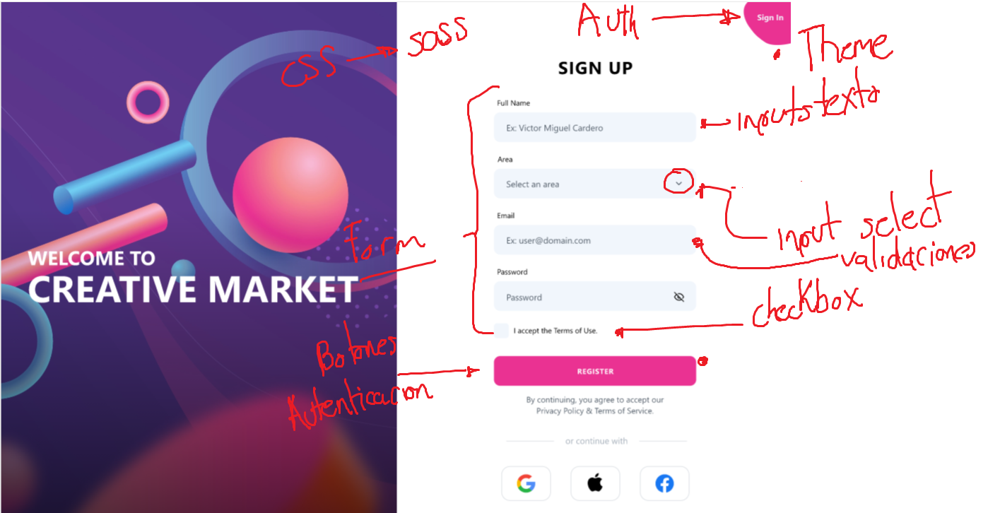
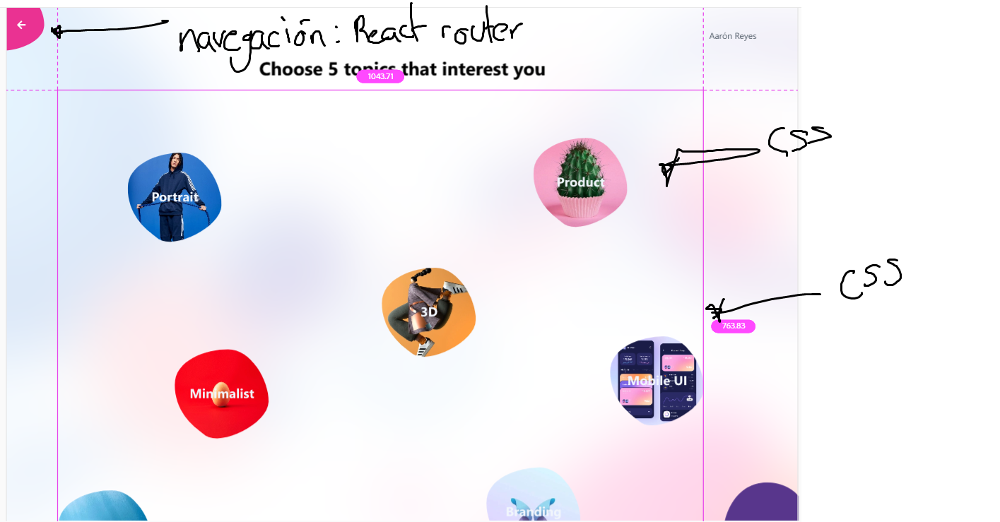

# Utils

- [Prototipo](https://xd.adobe.com/view/426530b5-8af3-4fdb-92e8-8b2389019481-1736/screen/269f203e-4a99-4cf4-8da9-1b5a46f05e3b/specs/)
  - [Fuente del prototipo](https://dribbble.com/shots/13914253-Adobe-XD-Playoff-Done)
- [Dribbble](https://dribbble.com/)
- [Behance](https://www.behance.net/)

# Creación de una app

1. Crea una aplicación de react en el directorio en curso ([referencia](https://create-react-app.dev/docs/adding-typescript/)):

Ejemplo del comando:

```bash
npx create-react-app . my-app --template typescript
```

Donde:

- npx create-react-app: nos ayuda a crear la app
- .: Especifica que se creará en el directorio en curso
- my-app: es el nombre de la aplicación
- --template: nos dice qué vamos a utilizar un template
- typescript: es el tamplate que se utilizará

> Boilerplate => App base con dependencias ya instaladas

Comando para crear la app:

```
npx create-react-app . cra-market-webapp --template typescript
```

# Stack inicial

Podemos obtener dependencias, tecnologías y librerías basados en el prototipo que nos dé UX/Diseño.




1. SASS: Theme (colores, tipos de letra, variables)
2. Autenticación/Sesión: Middleware, Local Storage, JWT, Redux
3. Form: ¿qué librería?
4. Validaciones de formulario: ¿qué librería?
5. Botones = UI: librería para UI
6. Inputs = UI: librería para UI
7. Select = UI: librería para UI
8. Checkbox = UI: librería para UI
9. Navegación: Router y Rutas protegidas

## Traducción de dependencias a librerías

1. [] [SASS](https://create-react-app.dev/docs/adding-a-sass-stylesheet/)
2. [] [Redux](https://react-redux.js.org/introduction/getting-started)
3. [] [React Hook Form](https://react-hook-form.com/)
4. [] [Yup](https://www.npmjs.com/package/yup)
5. [] [Mantine](https://mantine.dev/)
6. [] [React Router](https://reactrouter.com/)

## Theme

> Es recomendable iniciar una app con un theme ya definido. Con theme me refiero colores, tipografía, espaciados (opcional), tamaños de letra, todo lo que tenga que ver con lo visual y que SASS/UI nos pueda ayudar
